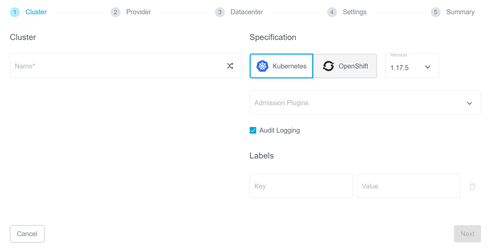
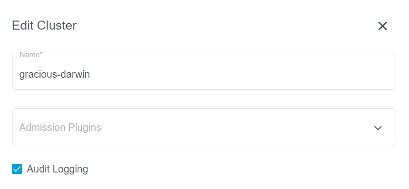

+++
title = "Audit Logging"
date = 2020-04-02T14:50:15+02:00
weight = 120
+++

Audit Logging is one of key security features provided by Kubernetes. Once enabled in kube-api, it provides a chronological record of operations performed on the cluster by users, administrators and other cluster components.

Audit logging is also a key requirement of the [Kubernetes CIS benchmark](https://www.cisecurity.org/benchmark/kubernetes/).

For more details, you can refer to the [upstream documentation](https://kubernetes.io/docs/tasks/debug-application-cluster/audit/).

### Kubermatic Kubernetes Platform (KKP) Support
KKP provides two levels of support for the Audit Logging:

* Audit Logging on user-cluster level
* Audit Logging on a datacenter level

{}
Kubernetes Audit Logging is optional and is not enabled by default, since it requires additional memory and storage resources, depending on the specific configuration used.
{}

Once enabled, KKP will use a [Log Backend](https://kubernetes.io/docs/tasks/debug-application-cluster/audit/#log-backend) and a minimal [Policy](https://kubernetes.io/docs/tasks/debug-application-cluster/audit/#audit-policy) by default:

```yaml

```

This file is stored in a ConfigMap named `audit-config` on the [Seed Cluster]() in your cluster namespace. To modify the default policy, you can edit this ConfigMap using `kubectl`:

```bash
$ kubectl edit -n cluster-<YOUR CLUSTER ID> configmap audit-config
```


#### User-Cluster Level Audit Logging

To enable user-cluster level Audit Logging, simply check `Audit Logging` in the KKP dashboard `Create Cluster` page:



For exiting clusters, you can go to the cluster page, edit your cluster and enable (or disable) `Audit Logging`:



#### Datacenter Level Audit Logging

KKP also supports enabling Audit Logging on the datacenter level. In this case, the option is enforced on all user-clusters in the datacenter. The user-cluster level flag is ignored in this case.

To enable this, you will need to edit your [datacenters.yaml]() or your [Seed Cluster CRD](), and set `enforceAuditLogging` to `true` in the datacenter spec.
