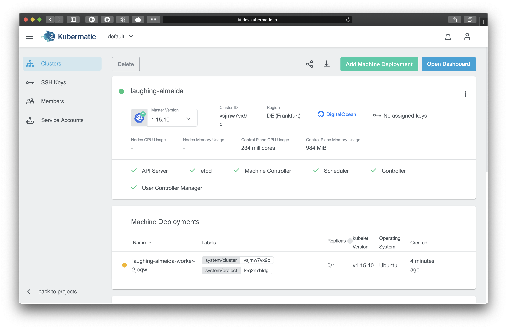
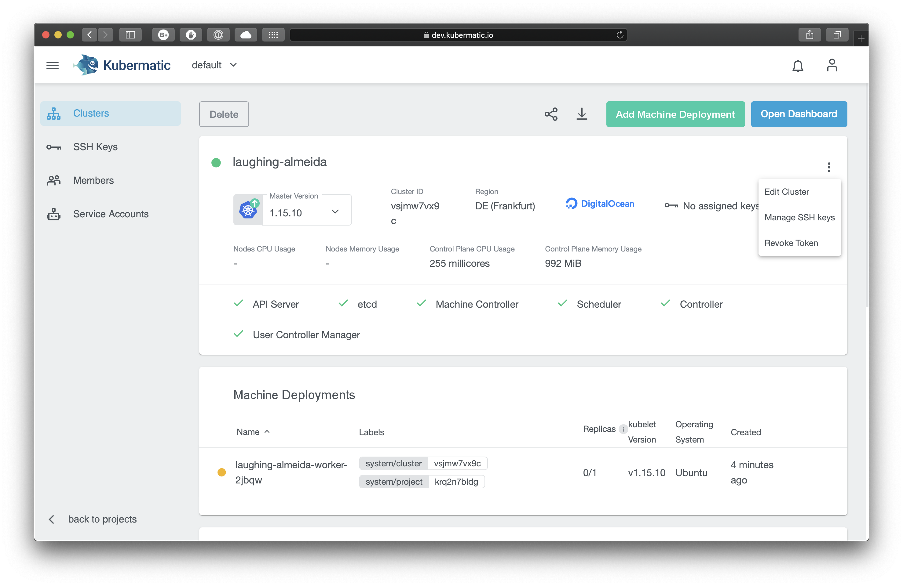
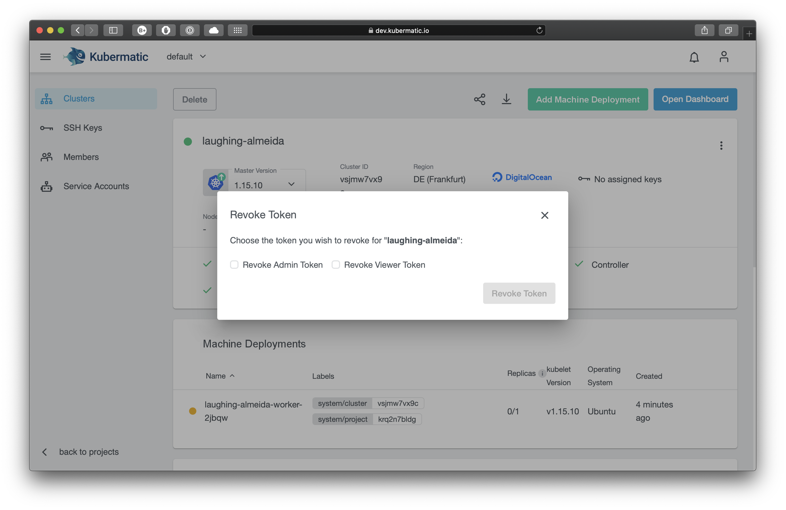

+++
title = "Using kubectl"
date = 2019-11-13T12:07:15+02:00
weight = 70
+++


Using kubectl requires the installation of kubectl on your system as well as downloading of kubeconfig on the cluster UI page. 
See the [Official kubectl Install Instructions](https://kubernetes.io/docs/tasks/tools/install-kubectl/) for a tutorial on how to install kubectl on your system. Once you have it installed, [download the kubeconfig](../06-download-kubeconfig/). The below steps will guide you on how to download a kubeconfig. 

To download the kubeconfig, navigate to `Clusters` and select the correct cluster. On the top right you can find a download button:



You can revoke access for already downloaded kubeconfigs by revoking the token on the cluster detail page. To do so, click on the three-dot settings icon on the right to see the option `Revoke Token`:



Users in the groups `Owner` and `Editor` have an admin token in their kubeconfig. Users in the group `Viewer` have a viewer token. Revoking the token for a user group means the kubeconfig becomes unusable for users in this group and they need to download it again. Using `kubectl` with the invalid kubeconfig will result in an error message. You can see which group every project member belongs to on the `Members` page.




Once you have installed the kubectl and downloaded the kubeconfig,change into the download directory and export it to your environment:


```bash
$ export KUBECONFIG=$PWD/kubeconfig-admin-czmg7r2sxm
$ kubectl version
Client Version: version.Info{Major:"1", Minor:"13", GitVersion:"v1.13.0", GitCommit:"...", GitTreeState:"clean", BuildDate:"...", GoVersion:"go1.11.2", Compiler:"gc", Platform:"darwin/amd64"}
Server Version: version.Info{Major:"1", Minor:"14", GitVersion:"v1.14.8", GitCommit:"...", GitTreeState:"clean", BuildDate:"...", GoVersion:"go1.12.10", Compiler:"gc", Platform:"linux/amd64}
```
