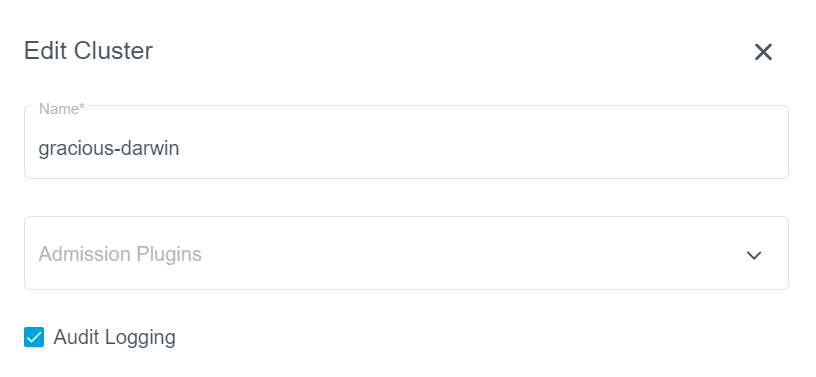

+++
title = "Audit Logging"
description = "Audit Logging is one of the key security features provided by Kubernetes. KKP provides two levels of audit logging: on user cluster level and on datacenter level."
date = 2021-11-08T12:00:00+02:00
weight = 130
+++

Audit Logging is one of the key security features provided by Kubernetes. Once enabled in the Kubernetes API server, it provides a chronological record of operations performed on the cluster by users, administrators and other cluster components.

Audit logging is also a key requirement of the [Kubernetes CIS benchmark](https://www.cisecurity.org/benchmark/kubernetes/).

For more details, you can refer to the [upstream documentation](https://kubernetes.io/docs/tasks/debug-application-cluster/audit/).

### Kubermatic Kubernetes Platform (KKP) Support
KKP provides two levels of support for the Audit Logging:

* Audit Logging on user-cluster level
* Audit Logging on a datacenter level

{}
Kubernetes Audit Logging is optional and is not enabled by default, since it requires additional memory and storage resources, depending on the specific configuration used.
{}

Audit logs, if enabled, are emitted by a sidecar container called `audit-logs` in the `kubernetes-apiserver` Pods on the [Seed Cluster]() in your cluster namespace. Setting up [the MLA stack on Master / Seed]() will allow storing the audit logs alongside other Pod logs collected by the MLA stack.

Initially, KKP will set up a minimal [Policy](https://kubernetes.io/docs/tasks/debug-application-cluster/audit/#audit-policy):

```yaml

```

This file is stored in a ConfigMap named `audit-config` on the [Seed Cluster]() in your cluster namespace. To modify the default policy, you can edit this ConfigMap using `kubectl`:

```bash
$ kubectl edit -n cluster-<YOUR CLUSTER ID> configmap audit-config
```

#### User-Cluster Level Audit Logging

To enable user-cluster level Audit Logging, simply check `Audit Logging` in the KKP dashboard `Create Cluster` page:


For exiting clusters, you can go to the cluster page, edit your cluster and enable (or disable) `Audit Logging`:



#### Datacenter Level Audit Logging

KKP also supports enabling Audit Logging on the datacenter level. In this case, the option is enforced on all user-clusters in the datacenter. The user-cluster level flag is ignored in this case.

To enable this, you will need to edit your [datacenter definitions in a Seed](), and set `enforceAuditLogging` to `true` in the datacenter spec.
