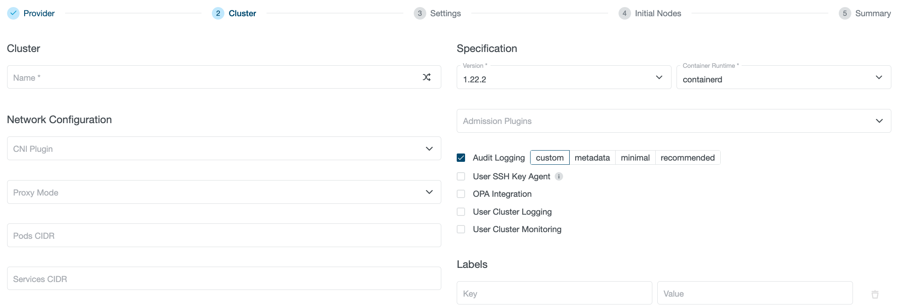
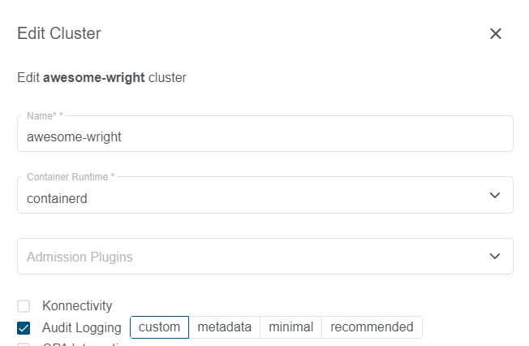

+++
title = "Audit Logging"
date = 2021-11-08T12:00:00+02:00
weight = 19
+++

Audit Logging is one of the key security features provided by Kubernetes. Once enabled in the Kubernetes API server, it provides a chronological record of operations performed on the cluster by users, administrators and other cluster components.

Audit logging is also a key requirement of the [Kubernetes CIS benchmark](https://www.cisecurity.org/benchmark/kubernetes/).

For more details, you can refer to the [upstream documentation](https://kubernetes.io/docs/tasks/debug-application-cluster/audit/).

## Kubermatic Kubernetes Platform (KKP) Support
KKP provides two levels of support for the Audit Logging:

* Audit Logging on user-cluster level
* Audit Logging on a datacenter level

{}
Kubernetes Audit Logging is optional and is not enabled by default, since it requires additional memory and storage resources, depending on the specific configuration used.
{}

Audit logs, if enabled, are emitted by a sidecar container called `audit-logs` in the `kubernetes-apiserver` Pods on the [Seed Cluster]() in your cluster namespace. Setting up [the MLA stack on Master / Seed]() will allow storing the audit logs alongside other Pod logs collected by the MLA stack.

if you do not choose an [audit policy preset](#audit-policy-presets), KKP will set up a minimal [audit policy](https://kubernetes.io/docs/tasks/debug-application-cluster/audit/#audit-policy) for you.
This file is stored in a ConfigMap named `audit-config` on the [Seed Cluster]() in your cluster namespace. To modify the default policy, you can edit this ConfigMap using `kubectl`:

```bash
$ kubectl edit -n cluster-<YOUR CLUSTER ID> configmap audit-config
```

```yaml

```

### Audit Policy Presets

KKP supports a set of maintained audit policies as presets in case you do not want to tune the audit policy for yourself.
A preset can be selected during cluster creation in the UI or by setting the field `auditLogging.policyPreset` on a
user-cluster spec (when audit logging is enabled). The preset selection can be unset by setting the field to an empty string.

{}
Enabling an audit policy preset on your user-cluster will override any manual changes to the `audit-config` ConfigMap.
{}

The following presets are available right now:

- `metadata`: Logs metadata for any request (matches the default policy configured when using no policy preset)
- `minimal`: Is considered the bare minimum that allows to audit for key operations on the cluster. Logs the following operations:
    - any modification to `Pods`, `Deployments`, `StatefulSets`, `DaemonSets` and `ReplicaSets` (complete request and response bodies)
    - any access to Pods via shell (by using `exec` to spawn a process) or port-forwarding/proxy (complete request and response bodies)
    - access to container logs (metadata only)
    - any access (read, write or delete) to `Secrets` and `ConfigMaps` (metadata only, as the request body could include sensitive information)
- `recommended`: Logs everything in `minimal` plus metadata for any other request. This is the most verbose audit policy preset, but is recommended due to its extended coverage of security recommendations like the CIS Benchmark

## Custom Output Configuration

In some situations the default behaviour of writing the audit logs to standard output and processing them alongside regular container logs might not be desirable. For those cases, `Cluster` objects support custom configuration for the [fluentbit](https://fluentbit.io/) sidecar via `spec.auditLogging.sidecar` (also see [CRD reference]()).

In specific, `spec.auditLogging.sidecar.config` has three fields that allow custom elements in the fluent-bit configuration. All sections in this are maps, which means any key and value can be given to set specific values.

{}
Configuration options are not validated before being passed to fluentbit, so it is strongly recommended to test settings on non-production user clusters before applying them.
{}

The available options are:

- `service`: Configures the [[SERVICE]](https://docs.fluentbit.io/manual/administration/configuring-fluent-bit/classic-mode/configuration-file#config_section) section, enabling fine-tuning of fluentbit. Note that some options alter fluentbit's behaviour and can cause issues in some cases (for example, adjusting the `daemon` setting).
- `filters`: Configures one or several [[FILTER]](https://docs.fluentbit.io/manual/administration/configuring-fluent-bit/classic-mode/configuration-file#config_filter) sections. To match audit logs, put a `match: '*'` directive in your filter definition. See [fluentbit documentation](https://docs.fluentbit.io/manual/pipeline/filters) for available filters.
- `outputs` Configures one or several [[OUTPUT]](https://docs.fluentbit.io/manual/administration/configuring-fluent-bit/classic-mode/configuration-file#config_output) sections. See [fluentbit documentation](https://docs.fluentbit.io/manual/pipeline/outputs) for available outputs.

Since this setting is part of the cluster specification, you might have the requirement to avoid disclosing credentials used to access your log output targets (a company-wide logging system, for example). In those situations, it is recommended to set up a central forwarder in your seed cluster that is then used by fluentbit outputs. This is possible by e.g. setting up [fluentd](https://www.fluentd.org/) and using a [forward output](https://docs.fluentbit.io/manual/pipeline/outputs/forward).

Be aware that the [API server network policy feature]() will block the sidecar from sending logs to an external output by default. You will need to set up a custom egress NetworkPolicy that matches the `app=apiserver` Pod label. The specific policy depends on where you are planning to send your logs (for example, an in-cluster service can be targeted via label matching, while external services will need to be allowed by IP address).

An example configuration could look like this:

```yaml
# Cluster spec snippet, not a complete configuration
spec:
  auditLogging:
    enabled: true
    sidecar:
      config:
        service:
            Flush: 10
        filters:
          - Name: grep
            Match: *
            Regex: "user@example.com"
        outputs:
          - Name: forward
            Match: *
            Host: "fluentd.audit-forward.svc.cluster.local"
```

This configures the fluentbit sidecar to flush incoming audit logs every 10 seconds, filters them by a string (`user@example.com`) and writes them to a manually deployed fluentd service available in-cluster.

### Audit Logs Source Identification

Depending on your architecture, it might be advisable to use the sidecar configuration options to enrich logs with metadata, e.g. the cluster name. This is likely necessary to differentiate the source of your audit logs in a central storage location. This can be done via a filter plugin, like this:

```yaml
# snippet, needs to be added to spec.auditLogging.sidecar
filters:
  - Name: record_modifier
    Match: *
    Record: cluster <CLUSTER ID>
```

Replace `<CLUSTER ID>` with the ID of your cluster.

Future KKP releases may add an environment variable to automatically get the cluster ID or even enrich records with this information by default.

## User Cluster Level Audit Logging

To enable user-cluster level Audit Logging, simply check `Audit Logging` in the KKP dashboard `Create Cluster` page. You can either select "custom" to be able to edit the ConfigMap for audit logging later on or set your cluster up with a [preset](#audit-policy-presets):



For exiting clusters, you can go to the cluster page, edit your cluster and enable (or disable) `Audit Logging`:



## Datacenter Level Audit Logging

KKP also supports enabling Audit Logging on the datacenter level. In this case, the option is enforced on all user-clusters in the datacenter. The user-cluster level flag is ignored in this case.

To enable this, you will need to edit your [datacenter definitions in a Seed](), and set `enforceAuditLogging` to `true` in the datacenter spec.
