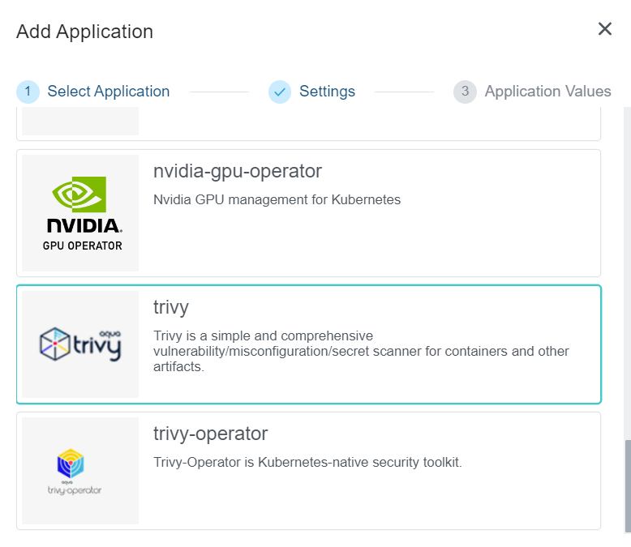
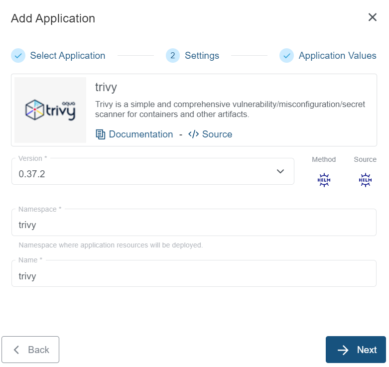

+++
title = "Trivy Application"
linkTitle = "Trivy"
enterprise = true
date = 2024-01-16T12:57:00+02:00
weight = 8

+++

# What is Trivy?

Trivy is a comprehensive and versatile security scanner. Trivy has scanners that look for security issues, and targets where it can find those issues.

Targets (what Trivy can scan):

- Container Image
- Filesystem
- Git Repository (remote)
- Virtual Machine Image
- Kubernetes
- AWS

Scanners (what Trivy can find there):

- OS packages and software dependencies in use (SBOM)
- Known vulnerabilities (CVEs)
- IaC issues and misconfigurations
- Sensitive information and secrets
- Software licenses

Trivy supports most popular programming languages, operating systems, and platforms.

For more information on the Trivy, please refer to the [official documentation](https://aquasecurity.github.io/trivy/v0.49/docs/)

# How to deploy?

Trivy is available as part of the KKP's default application catalog.
It can be deployed to the user cluster either during the cluster creation or after the cluster is ready(existing cluster) from the Applications tab via UI.

* Select the Trivy application from the Application Catalog.

* Under the Settings section, select and provide appropriate details and clck `-> Next` button.

* Under the Application values page section, check the default values and add values if any required to be configured explicitly. Finally click on the `+ Add Application` to deploy the Trivy application to the user cluster.

To further configure the values.yaml, find more information on the [Trivy Helm chart documentation](https://github.com/aquasecurity/trivy/tree/main/helm/trivy).
