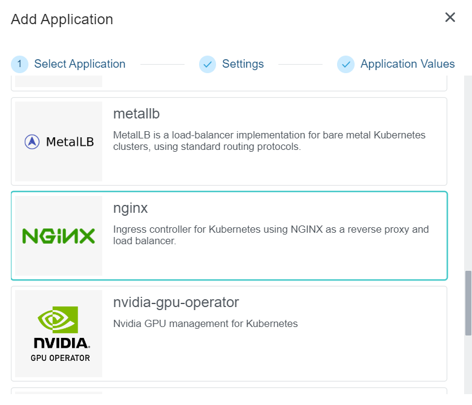
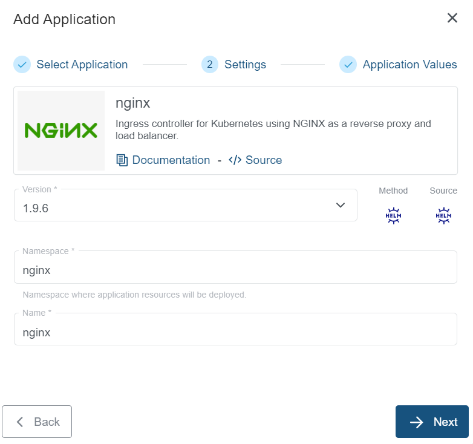

+++
title = "Nginx Application"
linkTitle = "Nginx"
enterprise = true
date = 2024-01-16T12:57:00+02:00
weight = 5

+++

## What is Nginx?

Nginx is an ingress-controller for Kubernetes using NGINX as a reverse proxy and load balancer.

For more information on the Nginx, please refer to the [official documentation](https://kubernetes.github.io/ingress-nginx/)

## How to deploy?

Nginx is available as part of the KKP's default application catalog.
It can be deployed to the user cluster either during the cluster creation or after the cluster is ready(existing cluster) from the Applications tab via UI.

- Select the Nginx application from the Application Catalog.

- Under the Settings section, select and provide appropriate details and click `-> Next` button.

- Under the Application values page section, check the default values and add values if any required to be configured explicitly. Finally click on the `+ Add Application` to deploy the Nginx application to the user cluster.

To further configure the values.yaml, find more information on the [Nginx Helm chart documentation](https://github.com/kubernetes/ingress-nginx/tree/main/charts/ingress-nginx).
