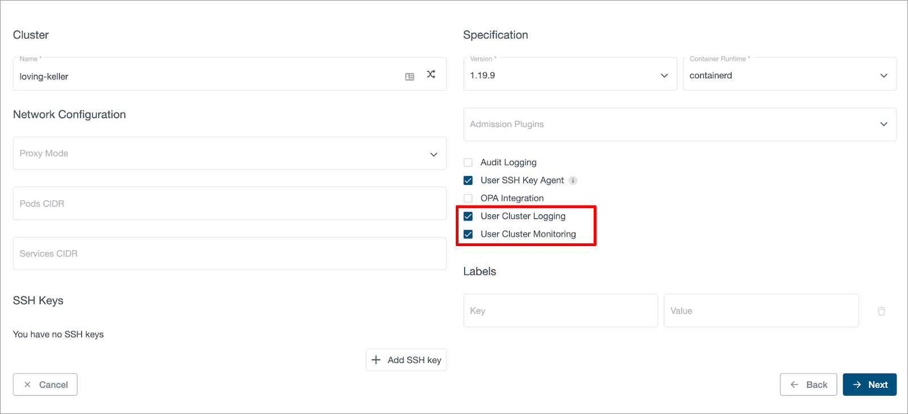
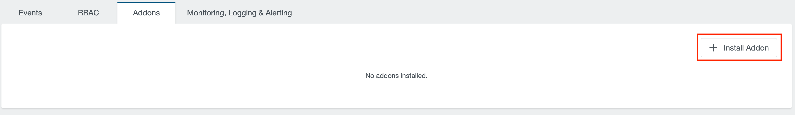
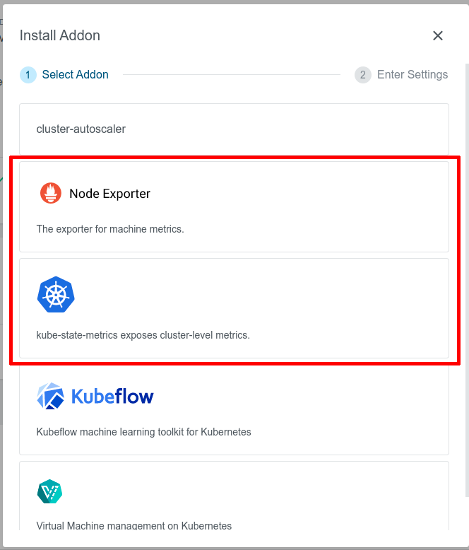
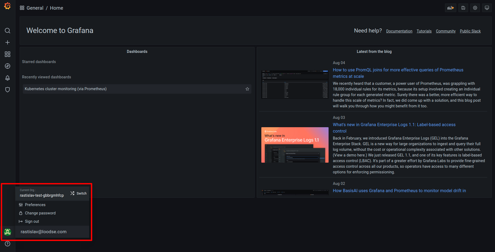
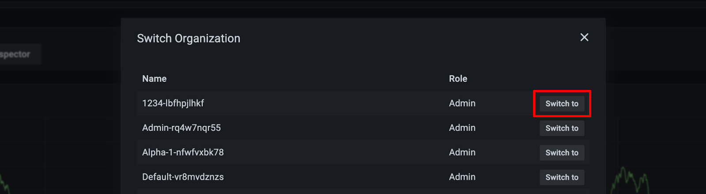
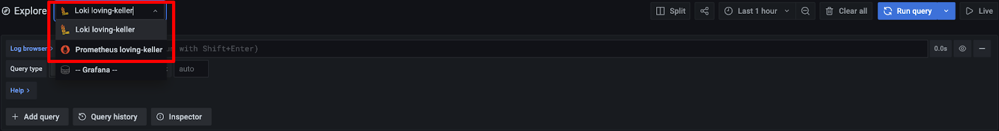
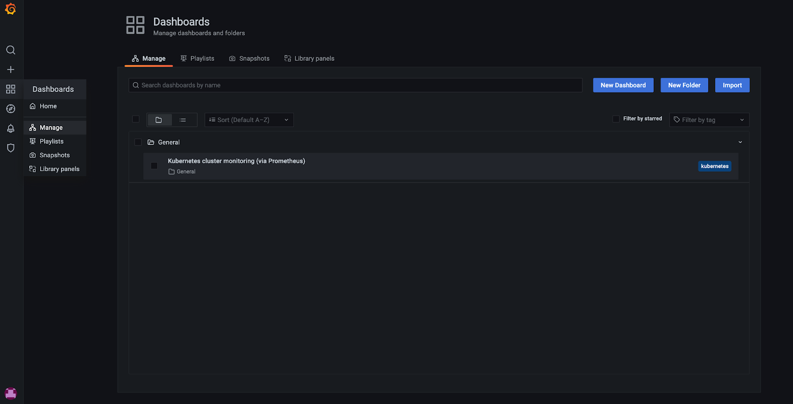
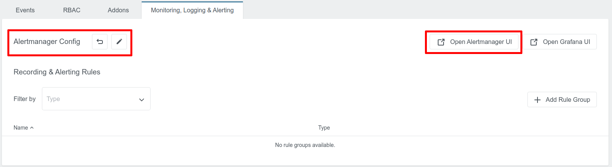
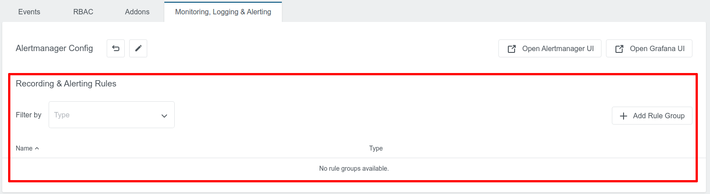
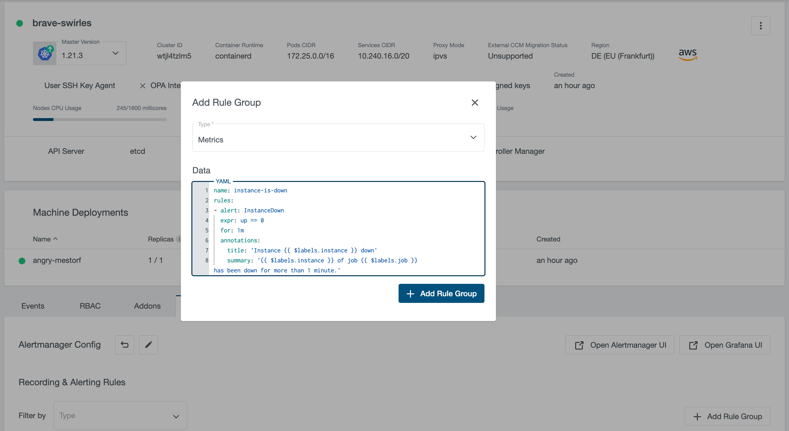

+++
linkTitle = "User Guide"
title = "User Guide of the User Cluster MLA Stack"
date = 2020-02-14T12:07:15+02:00
weight = 10
+++

This page contains a user guide for the [User Cluster MLA Stack]().
The administrator guide is available at the [User Cluster MLA Admin Guide]() page.

## Enabling Monitoring & Logging in a User Cluster

Once the User Cluster MLA feature is enabled in KKP, user can enable monitoring and logging for a user cluster via the KKP UI as shown below:



Users can enable monitoring and logging independently, and also can disable or enable them after the cluster is created.

## Enabling MLA Addons in a User Cluster

KKP provides several addons for user clusters, that can be helpful when the User Cluster Monitoring feature is enabled, namely:
- **node-exporter** addon: exposes hardware and OS metrics of worker nodes to Prometheus,
- **kube-state-metrics** addon: exposes cluster-level metrics of Kubernetes API objects (like pods, deployments, etc.) to Prometheus.

When these addons are deployed to user clusters, no further configuration of the user cluster MLA stack is needed,
the exposed metrics will be scraped by user cluster Monitoring Agent and become available in Grafana automatically.

Given that the addons have been already [enabled in the KKP installation](), they can be enabled via the KKP UI on the cluster page, as shown below:





## Exposing Application Metrics

User Cluster MLA stack defines some common metrics scrape targets for Monitoring Agent by default. As part of that, it is configured to scrape metrics from all Kubernetes pods and service endpoints, provided they have the correct annotations. Thanks to that, it is possible to add custom metrics scrape targets for any applications running in user clusters.
Apart from that, it is also possible to extend the scraping configuration with custom targets using ConfigMaps, as described later in this section.

### Adding Scrape Annotations to Your Applications

In order to expose Prometheus metrics of any Kubernetes pod or service endpoints, add `prometheus.io` scraping annotations to the pod / service specification. For example:

```yaml
metadata:
  annotations:
    prometheus.io/scrape: "true"
    prometheus.io/path: /metrics
    prometheus.io/port: "8080"
```

Note that the values for `prometheus.io/scrape` and `prometheus.io/port` must be enclosed in double quotes.

The metric endpoints exposed via annotations will be automatically discovered by the User Cluster Monitoring Agent and made available in the MLA Grafana UI without any further configuration.

The following annotations are supported:

| Annotation                | Example value | Description
| ------------------------- | ------------- | ------------
| prometheus.io/scrape      | `"true"`      | Only scrape pods / service endpoints that have a value of `true`
| prometheus.io/scrape-slow | `"true"`      | The same as `prometheus.io/scrape`, but will scrape metrics in longer intervals (5 minutes)
| prometheus.io/path        | `/metrics`    |  Overrides the metrics path, the default is `/metrics`
| prometheus.io/port        | `"8080"`      | Scrape the pod / service endpoints on the indicated port

For more information on exact scraping configuration and annotations, reference the user cluster Grafana Agent configuration in the `monitoring-agent` ConfigMap (`kubectl get configmap monitoring-agent -n mla-system -oyaml`) against the prometheus documentation for [kubernetes_sd_config](https://prometheus.io/docs/prometheus/latest/configuration/configuration/#kubernetes_sd_config) and [relabel_config](https://prometheus.io/docs/prometheus/latest/configuration/configuration/#relabel_config).

### Extending Scrape Config
It is also possible to extend User Cluster Grafana Agent with custom `scrape_config` targets. This can be achieved by adding ConfigMaps with a pre-defined name prefix `monitoring-scraping` in the `mla-system` namespace in the user cluster. For example, a file `example.yaml` which contains customized scrape configs can look like the following:

```yaml
- job_name: 'monitoring-example'
  static_configs:
  - targets: ["localhost:9090"]
- job_name: 'schnitzel'
  kubernetes_sd_configs:
  - role: pod
  relabel_configs:
  - source_labels: [__meta_kubernetes_pod_annotation_kubermatic_scrape]
    action: keep
    regex: true
```

User can create a ConfigMap from the above file by doing:

```bash
kubectl create configmap monitoring-scraping-test --from-file=example.yaml -n mla-system
```

User Cluster Monitoring Agent will reload configuration automatically after executing the above command. Please note that users will need to make sure to provide valid scrape configs. Otherwise, User Cluster Monitoring Agent will not reload configuration successfully and crash. For more information about Scrape Config of Prometheus, please refer to [Prometheus Scrape Config Documentation](https://prometheus.io/docs/prometheus/latest/configuration/configuration/#scrape_config).

## Accessing Metrics & Logs in Grafana

Once monitoring and/or logging are enabled for a user cluster, users can access the Grafana UI to see metrics and logs of this user cluster.

### Switching between Grafana Organizations

Every KKP Project is mapped to a Grafana Organization with name of `<project-name>- <project-id>` respectively, and if users want to access metrics and logs of different user clusters which belong to different KKP Projects, they can navigate between different Grafana Organizations as shown below (in the bottom left corner of Grafana UI, navigate to your profile icon - > Current Org. -> Switch):





User’s permission in Grafana Organization is tied to the role in the KKP Project. The table below demonstrates the mapping between KKP role and Grafana Organization role:

| KKP Role        | Grafana Organization Role |
| --------------- | ------------------------- |
| Project Owner   | Organization Editor       |
| Project Editor  | Organization Editor       |
| Project Viewer  | Organization Viewer       |

For more details about what a user is allowed to do in Grafana Organization, please check the [Grafana Organization role documentation](https://grafana.com/docs/grafana/latest/permissions/organization_roles/).

### Grafana Datasources of User Clusters

For every user cluster with MLA enabled, corresponding Grafana Datasources will be automatically created within the Grafana Organization:

- A Datasource with the name `Loki <cluster-name>` is created for accessing logs data if User Cluster Logging is enabled.
- A Datasource with the name `Prometheus <cluster-name>` is created for accessing metrics data if User Cluster Monitoring is enabled.



### Grafana Dashboards

There are some pre-installed Grafana Dashboards which can be found in Grafana UI under Dashboards -> Manage:



KKP administrators can configure the set of Dashboards deployed for each user cluster - see the Manage Grafana Dashboard section of the Admin guide.

Users can also add their own custom Dashboards for more data visualization via Grafana UI, please check [Grafana Dashboards documentation](https://grafana.com/docs/grafana/latest/dashboards/) for more details. Please note that these will be deleted if the Grafana Organization is deleted, or if Grafana persistent volume is deleted.

## Alertmanager

KKP provides API and UI to allow users to configure Alertmanager on a per user cluster basis. The “Monitoring, Logging & Alerting” tab will be visible if monitoring or logging is enabled for the user cluster:



There will be a default Alertmanager configuration which is created by KKP, and users can click “Open Alertmanager UI” to navigate to the Alertmanager UI.

Users can configure Alertmanager configuration with customized receivers and templates, as shown below. For details, please check the [Cortex Alertmanager example](https://cortexmetrics.io/docs/api/#example-request-body) and [Prometheus Alertmanager Configuration](https://prometheus.io/docs/alerting/latest/configuration/) documentation.

## Recording Rules & Alerting Rules

KKP User Cluster MLA supports Prometheus-compatible rules for metrics and logs. The table on the “Monitoring, Logging & Alerting” tab can be used to manage both recording rules and alerting rules:



It supports rules for both metrics and logs. For adding a new rule group, click on the “+ Add Rule Group” button, select the rule type and fill the “Data” input with rule group in YAML format:



For more information about Prometheus rules, please check [Prometheus Recording Rules](https://prometheus.io/docs/prometheus/latest/configuration/recording_rules/) and [Prometheus Alerting Rules](https://prometheus.io/docs/prometheus/latest/configuration/alerting_rules/).

For setting up Alertmanager with alerting rules for metrics and logs, please refer to [Walkthrough Tutorial: Setting up Alertmanager with Slack Notifications]().

## User Cluster Monitoring & Logging Agents Resource Request & Limits

As described on the [User Cluster MLA Stack Architecture]() page, the user cluster MLA stack deploys two instances of Grafana Agent into the KKP user clusters: one for monitoring (`monitoring-agent`) and one for logging (`logging-agent`). The resource consumption of these components highly depends on the actual workload running in the user cluster. By default, they run with the following resource requests & limits:

**monitoring-agent**:

| Resource | Requests | Limits
| -------- | -------- | ------
| CPU      | 100m     | 1
| Memory   | 256Mi    | 4Gi

**logging-agent**:

| Resource | Requests | Limits
| -------- | -------- | ------
| CPU      | 50m      | 200m
| Memory   | 64Mi     | 128Mi

Non-default resource requests & limits for user cluster Prometheus and Loki Promtail can be configured via KKP API endpoint for managing clusters (`/api/v2/projects/{project_id}/clusters/{cluster_id}`):

**monitoring-agent:**

- `spec.mla.monitoringResources.requests.cpu`
- `spec.mla.monitoringResources.requests.memory`
- `spec.mla.monitoringResources.limits.cpu`
- `spec.mla.monitoringResources.limits.memory`

**logging-agent:**

- `spec.mla.loggingResources.requests.cpu`
- `spec.mla.loggingResources.requests.memory`
- `spec.mla.loggingResources.limits.cpu`
- `spec.mla.loggingResources.limits.memory`

When no resource requests / limits for `monitoringResources` or `loggingResources` are specified, defaults from the table above are applied. As soon as any `monitoringResources` or `loggingResources` are configured, their exact values are used and no defaults are involved anymore. For example, if you specify `spec.mla.monitoringResources.requests.cpu` but no `spec.mla.monitoringResources.limits.cpu`, the `spec.mla.monitoringResources.limits.cpu` will be equal to zero - no CPU limits will be used.
