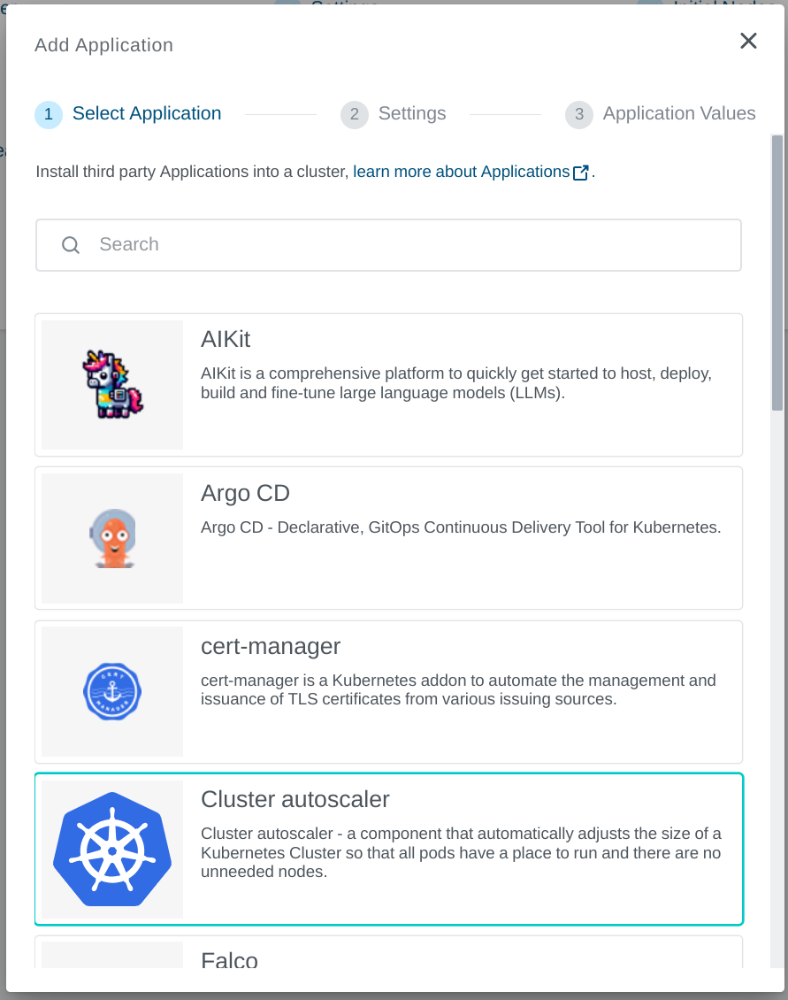
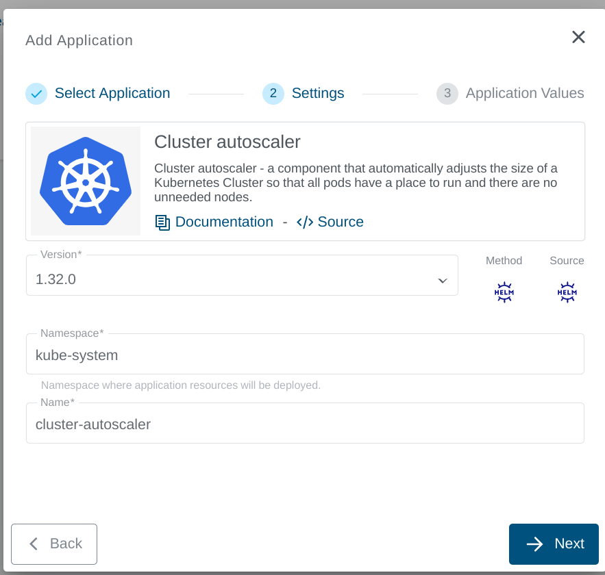
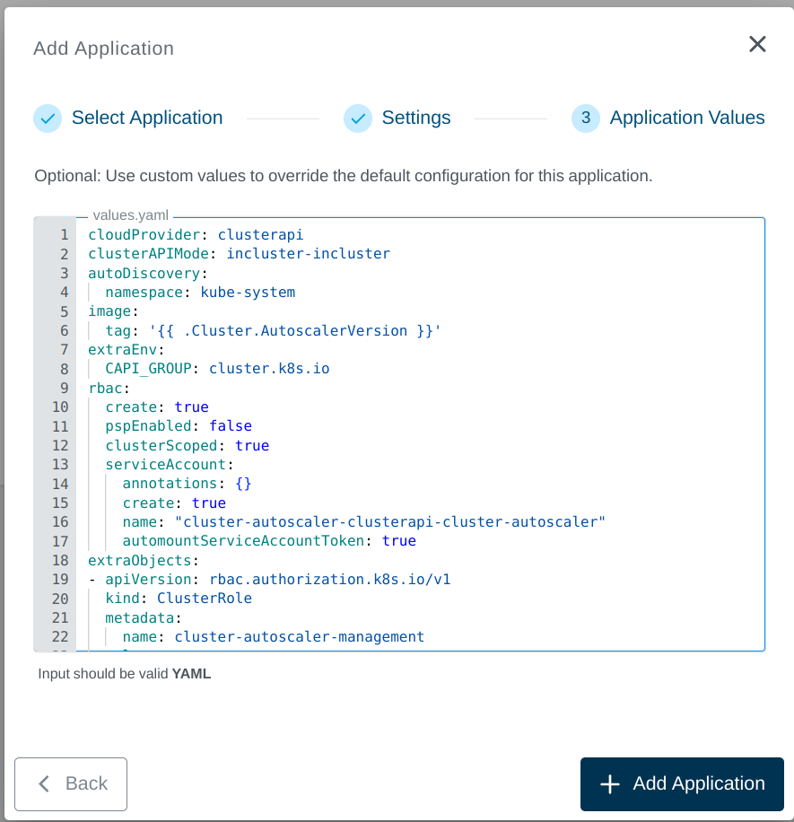

+++
title = "Cluster Autoscaler Application"
linkTitle = "Cluster Autoscaler"
enterprise = true
weight = 1

+++

## What is the Kubernetes Cluster Autoscaler?

Kubernetes Cluster Autoscaler is a tool that automatically adjusts the size of the worker’s node up or down depending on the consumption. This means that the cluster autoscaler, for example, automatically scale up a cluster by increasing the node count when there are not enough node resources for cluster workload scheduling and scale down when the node resources have continuously staying idle, or there are more than enough node resources available for cluster workload scheduling. In a nutshell, it is a component that automatically adjusts the size of a Kubernetes cluster so that all pods have a place to run and there are no unneeded nodes.

## How to deploy?

Kubernetes Cluster Autoscaler is available as part of the KKP's default application catalog.
It can be deployed to the user cluster either during the cluster creation or after the cluster is ready(existing cluster) from the Applications tab via UI.

- Select the Cluster Autoscaler application from the Application Catalog.

- Under the Settings section, select and provide appropriate details and click `-> Next` button.

- Under the Application values page section, check the default values and add values if any required to be configured explicitly. Finally click on the `+ Add Application` to deploy the Clustet Autoscaler application to the user cluster.

A full list of available Helm values is on [cluster autoscaler ArtifactHub page](https://artifacthub.io/packages/helm/cluster-autoscaler/cluster-autoscaler)
