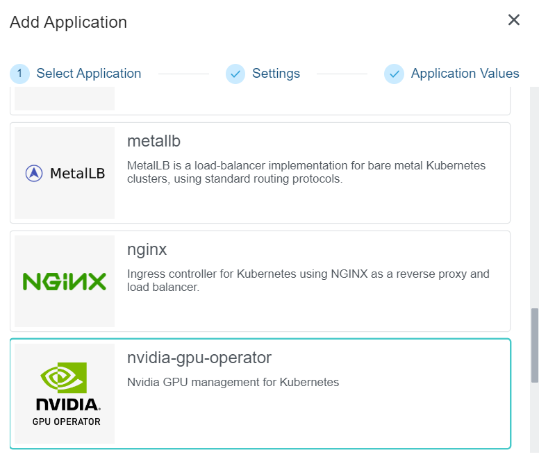
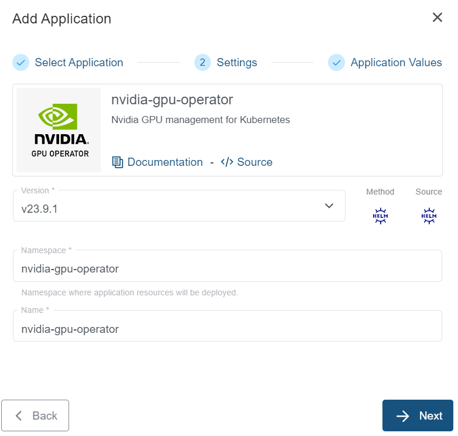

+++
title = "Nvidia GPU Operator Application"
linkTitle = "Nvidia GPU Operator"
enterprise = true
date = 2024-03-11T12:57:00+02:00
weight = 12

+++

## What is Nvidia GPU Operator?

The NVIDIA GPU Operator uses the operator framework within Kubernetes to automate the management of all NVIDIA software components needed to provision GPU.

For more information on the Nvidia GPU Operator, please refer to the [official documentation](https://docs.nvidia.com/datacenter/cloud-native/gpu-operator/latest/overview.html)

## How to deploy?

Nvidia GPU Operator is available as part of the KKP's default application catalog.
It can be deployed to the user cluster either during the cluster creation or after the cluster is ready(existing cluster) from the Applications tab via UI.

- Select the Nvidia GPU Operator application from the Application Catalog.

- Under the Settings section, select and provide appropriate details and click `-> Next` button.

- Under the Application values page section, check the default values and add values if any required to be configured explicitly. Finally click on the `+ Add Application` to deploy the Nvidia GPU Operator application to the user cluster.

To further configure the values.yaml, find more information on the [Nvidia GPU Operator Helm chart documentation](https://github.com/NVIDIA/gpu-operator/)

## DCGM metrics for NVIDIA GPUs

### What are DCGM metrics?

DCGM (Data Center GPU Manager) metrics are health and performance measurements exported by NVIDIA software. They include useful signals such as GPU temperature, memory usage, and utilization. These metrics are ready to be consumed by Prometheus and visualized in Grafana.

The following explains how DCGM metrics are exposed when you deploy the NVIDIA GPU Operator via the KKP application catalog and how to check that everything is working.

### How it works in KKP

When you deploy the Nvidia GPU Operator from the Application Catalog, DCGM metrics are enabled by default. It also deploys Node Feature Discovery (NFD), which automatically labels GPU nodes. These labels help the operator deploy a small exporter (dcgm-exporter) as a DaemonSet on those GPU nodes.

Key points:

- DCGM exporter listens on port 9400 and exposes metrics at the /metrics endpoint.
- By default, the gpu-operator Helm chart enables the `dcgmExporter` and `nfd` components.

### Quick check

1. Deploy the Nvidia GPU Operator from the Applications tab in KKP.
2. Wait for the application to finish installing (status should show deployed).
3. Confirm GPU nodes are labeled with the `feature.node.kubernetes.io/pci-10de.present=true` label (this is done automatically by NFD).
4. Confirm all pods in the `nvidia-gpu-operator` namespace are in the `Running` state.

### Troubleshooting

- No metrics found: make sure your nodes have NVIDIA GPUs and the Nvidia GPU Operator application is deployed. Check the DaemonSet for dcgm-exporter in the cluster.
- Exporter not running on a node: verify the node has the GPU label (NFD adds it). If not, re-check your operator deployment or the node configuration.

### Want to dig deeper?

If you'd like more detailed, technical steps (for example, changing scrape intervals or customizing the chart values), check the official GPU Operator Helm chart and the dcgm-exporter documentation:

- [NVIDIA GPU Operator on GitHub](https://github.com/NVIDIA/gpu-operator)
- [dcgm-exporter on GitHub](https://github.com/NVIDIA/dcgm-exporter)
