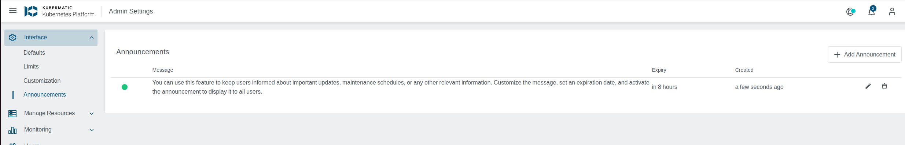
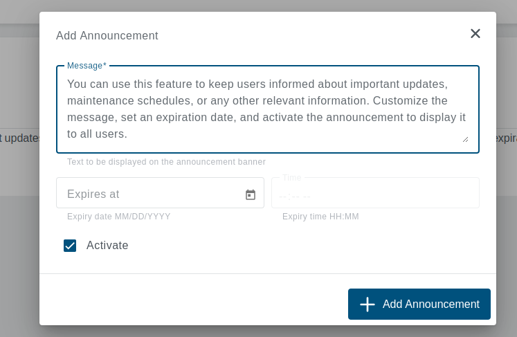
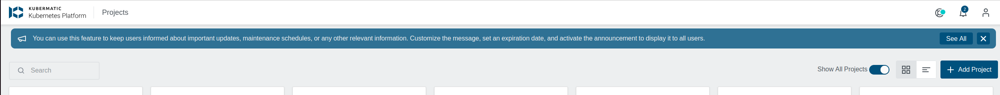
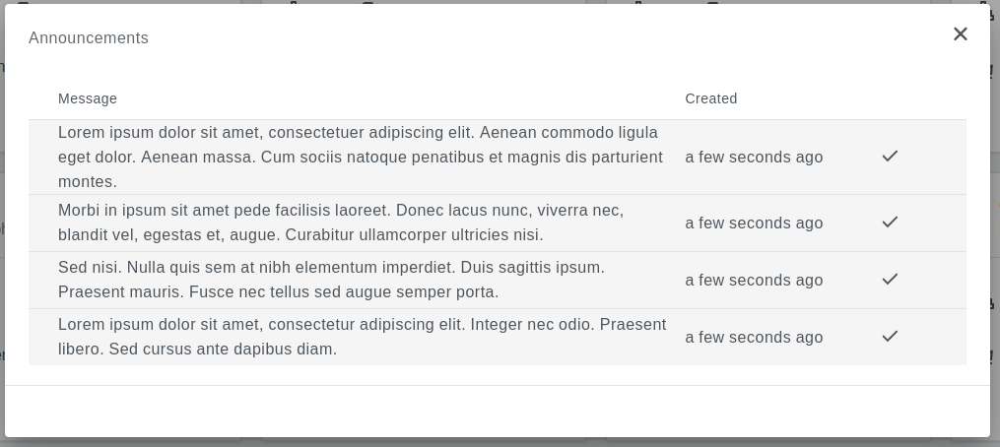
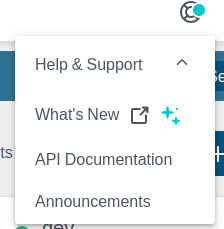

+++
title = "Admin Announcements"
date = 2022-02-17T11:07:15+02:00
weight = 20
+++

The Admin Announcement feature allows administrators to broadcast important updates, maintenance schedules, or other relevant information to users. These announcements are displayed on a banner across the user interface, ensuring that all users can view critical messages.

- ### [Announcement Page](#Announcement-Page)
- ### [Add Announcement](#add-announcement)
- ### [User View](#user-view)

## Announcement Page

The Announcement page provides the admin with a centralized location to manage all announcements. From here, you can add, edit, and delete announcements.

## Add Announcement

The dialog allows admins to add new announcements by customizing the message, setting an expiration date, and activating the announcement.

## User View

Users can see the latest unread active announcement across all pages from the announcement banner.

Users can also see a list of all active announcements by clicking the "See All" button. They can mark an announcement as read by clicking the close button.

You can also view all active announcements from the Help Panel.

