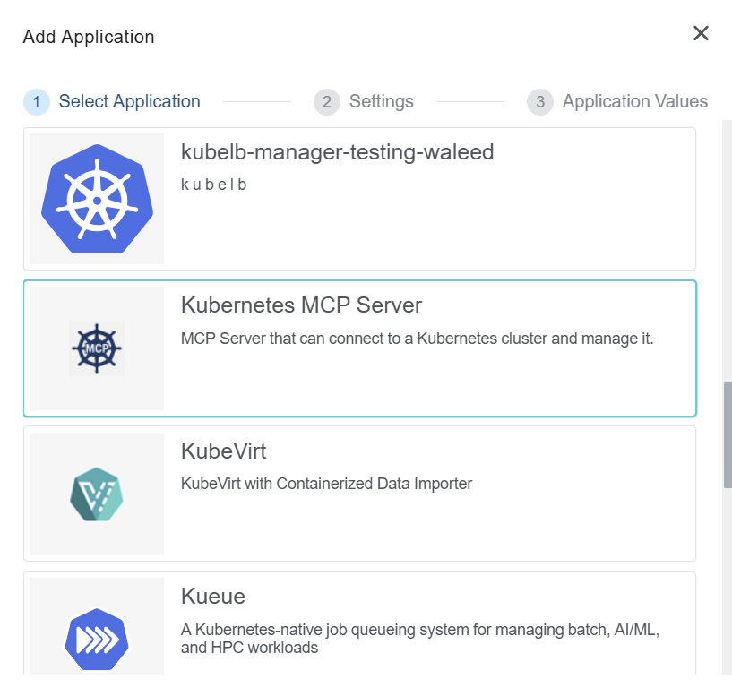
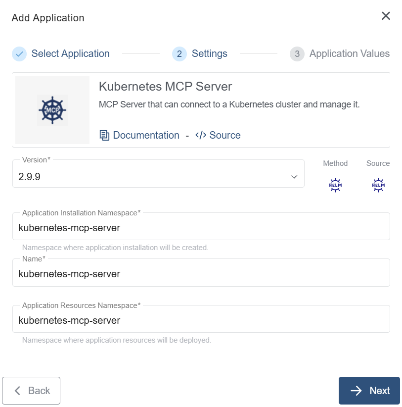
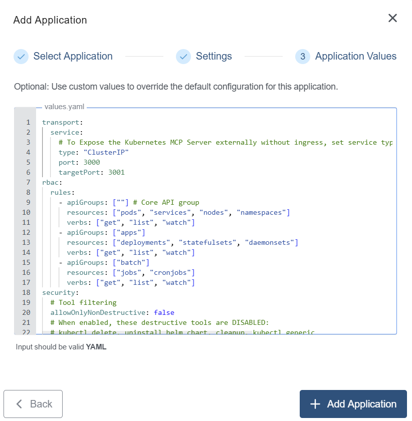
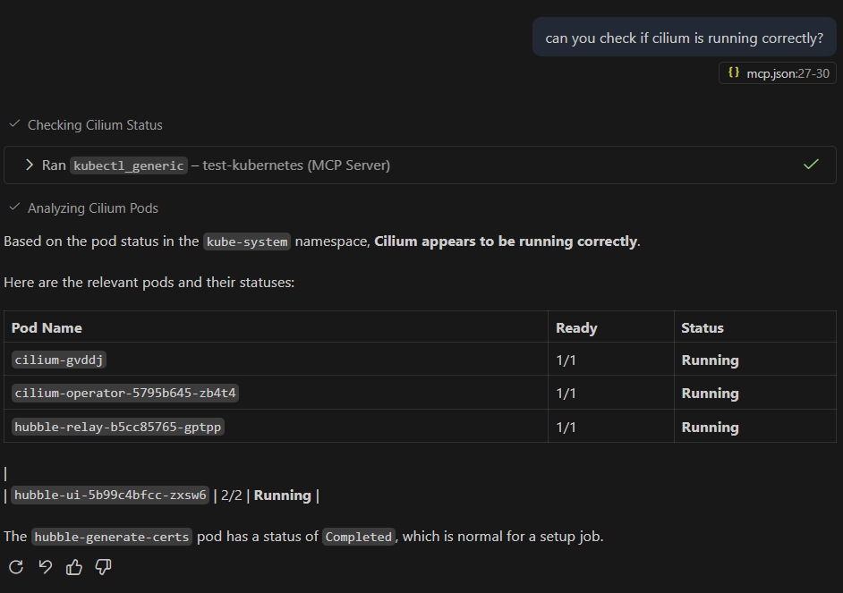

+++
title = "Kubernetes MCP Server"
linkTitle = "Kubernetes MCP Server"
enterprise = true
date = 2025-12-10T12:00:00+02:00
weight = 10
+++

## What is Kubernetes MCP Server?

The Kubernetes MCP Server is a Model Context Protocol ([MCP](https://modelcontextprotocol.io/docs/getting-started/intro)) server that can connect to a Kubernetes cluster and manage it. It provides an interface for LLMs to interact with Kubernetes resources, enabling operations like listing pods, describing resources, applying manifests, and more from your favourite copilot.

## How to deploy?

The Kubernetes MCP Server is available as part of the KKP's default application catalog. It can be deployed to the user cluster either during the cluster creation or after the cluster is ready (existing cluster) from the Applications tab via UI.

- Select the Kubernetes MCP Server application from the Application Catalog.



- Under the Settings section, select and provide appropriate details and click `-> Next` button.



3. Under the Application values page section, check the default values and add values if any required to be configured explicitly. Finally click on the `+ Add Application` to deploy the application to the user cluster.



## How to setup in VS Code?

By default, the Kubernetes MCP Server exposes a service via ClusterIP. To access it locally, you need to use `kubectl port-forward`.

1. Forward the service port to your local machine:

```bash
kubectl port-forward -n kubernetes-mcp-server svc/<service-name> 3000:3000
```

2. Configure the MCP server in your VS Code MCP settings (e.g. `mcp.json`):

```json
{
  "mcpServers": {
    "kubernetes-mcp-server": {
      "url": "http://localhost:3000/mcp",
      "type": "http"
    }
  }
}
```

3. Start the MCP server in VS Code, and you can now manage your cluster directly from your copilot chat.



For more advanced configuration and usage, please refer to the [official documentation](https://github.com/Flux159/mcp-server-kubernetes).
