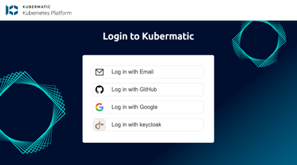

+++
title = "Using kubectl & kubelogin"
date = 2025-11-18T12:07:15+02:00
weight = 70
+++

## User Cluster kubeconfig Access

Using kubectl requires the installation of kubectl on your system as well as downloading of kubeconfig on the cluster UI page.
See the [Official kubectl Install Instructions](https://kubernetes.io/docs/tasks/tools/install-kubectl/) for a tutorial on how to install kubectl on your system. Once you have installed it, download the kubeconfig. The below steps will guide you on how to download a kubeconfig.

To download the kubeconfig, navigate to `Clusters` and select the correct cluster. On the top right you can find a download button circled with red box:


After clicking on the button, a download kubeconfig dialog will be opened.
You can choose the Kubeconfig OIDC authentication method — either KKP API or OIDC-kubelogin.


After you downloaded the kubeconfig file `kubeconfig-YOUR-CLUSTER-ID`, you can connect e.g. via CLI:
```bash
export KUBECONFIG=~/Downloads/kubeconfig-YOUR-CLUSTER-ID
kubectl get nodes
```

If you are using the kubelogin plugin, the authentication screen will appear on the first usage of `kubectl` and your authentication token is expired. The redirect of the plugin will bring you to the OIDC login window to ensure your authentication:



## Initial KKP Configuration for kubelogin support

As the OIDC-kubelogin plugin starts a local server on port 8000 or 18000 by default.
To use the OIDC-kubelogin option, you need to register the following redirect URIs with your OIDC provider:

```text
http://localhost:8000
http://localhost:18000 (used if port 8000 is already in use)
```

To achieve this, add the following lines to your issuer configuration (most likely `kubermaticIssuer`):

```yaml
## kubermatic values.yaml
      - id: kubermaticIssuer
        name: KubermaticIssuer
        secret: xxx
        RedirectURIs:
          - https://kkp.example.com/api/v1/kubeconfig
          - https://kkp.example.com/api/v2/dashboard/login
          - https://kkp.example.com/api/v2/kubeconfig/secret
          - http://localhost:8000   # -> add this line
          - http://localhost:18000  # -> add this line
```

Make sure to include the last two lines to enable local authentication via the OIDC-kubelogin plugin.

## Access Token Revoke Option

You can revoke access for already downloaded kubeconfigs by revoking the token on the cluster detail page. To do so, click on the three-dot settings icon on the right to see the option `Revoke Token`:


Users in the groups `Owner` and `Editor` have an admin token in their kubeconfig. Users in the group `Viewer` have a viewer token. Revoking the token for a user group means the kubeconfig becomes unusable for users in this group and they need to download it again. Using `kubectl` with an invalid kubeconfig will result in an error message. You can see which group every project member belongs to on the `Members` page.


