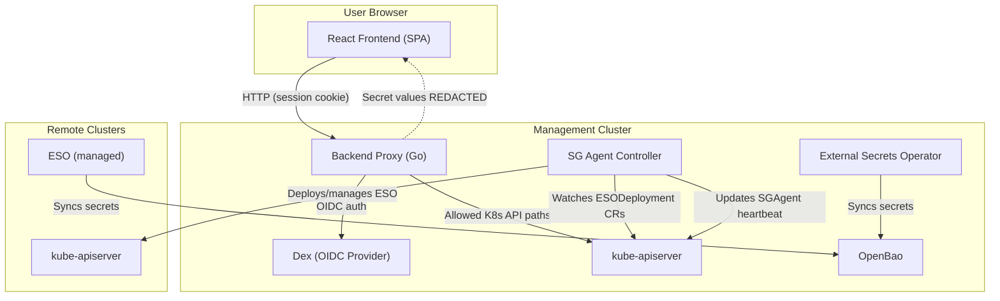
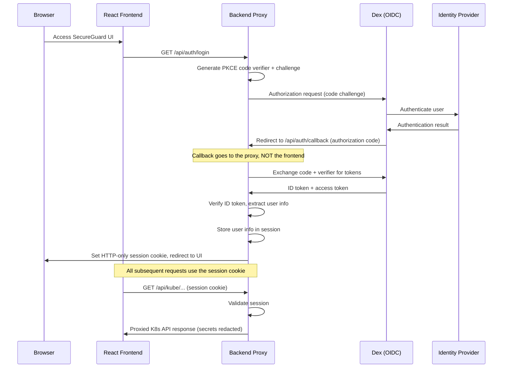

+++
title = "Architecture & Security Model"
date = 2026-06-13T09:00:00+02:00
weight = 2
description = "Component architecture, authentication flow, multi-cluster routing, and the zero-knowledge security model behind Kubermatic SecureGuard."
sitemapexclude = true
searchexclude = true
private = true
+++

Kubermatic SecureGuard is engineered with security and multi-layered protection as its core design principles. This document describes the component architecture, authentication flow, multi-cluster routing, and the zero-knowledge security model.

## Component Architecture

SecureGuard is not a single monolithic application. It is a composition of specialized open-source services coordinated via Kubernetes.

1. **React Frontend (Dashboard)** — A statically served Single Page Application (SPA) built with React and Vite. It runs in the user's browser, providing a modern interface to visualize and manage secret sync objects. The frontend is a **zero-knowledge client** — it never receives actual secret values.
2. **Backend Proxy** — A Go reverse proxy running in the cluster. It mediates all communication between the browser and Kubernetes, enforces route allowlisting, redacts secret values from API responses, and handles OIDC authentication with session cookies.
3. **SG Agent Controller** — A Go controller-runtime binary (`agent/`) that manages ESO lifecycle across clusters. It watches `ESODeployment` CRs on the management cluster and deploys, upgrades, or deletes ESO on remote clusters via multi-cluster kubeconfig contexts. It also maintains `SGAgent` CRs with heartbeat health status for each connected cluster.
4. **Dex (OIDC Provider)** — Handles federated identity and Single Sign-On (SSO). It authenticates users against corporate identity providers (Google, GitHub, Okta, LDAP) and issues OIDC tokens consumed exclusively by the backend proxy.
5. **OpenBao** — A Vault-compatible cryptographic engine managing secret storage, encryption, and audit logging. **Bundled as an opinionated default but optional** — SecureGuard manages ESO, which can instead target any supported provider (AWS Secrets Manager, GCP Secret Manager, Azure Key Vault, HashiCorp Vault, …).
6. **External Secrets Operator (ESO)** — Kubernetes custom controllers that continuously sync secrets from OpenBao (or any other supported provider) into native Kubernetes `Secret` resources.
7. **Federation Broker (optional)** — A standalone Go service (`federation/`, disabled by default) that serves secret values to remote clusters over mTLS without exposing the backend stores. It is a **separate trust boundary** from the zero-knowledge proxy — it is the only SecureGuard component that handles real secret values, runs under its own least-privilege ServiceAccount, and must never be colocated with the proxy. See [Federation]().

### Component Diagram

## The Security Model

### Zero-Knowledge Secret Handling

The primary security directive of SecureGuard is ensuring that **secret values never reach the browser**. This is enforced architecturally at the proxy layer — not by UI-level masking.

- **Proxy-Level Redaction**: The Go backend proxy intercepts all `v1/Secret` and `v1/SecretList` API responses via `ModifyResponse`. It replaces every value in `.data` and `.stringData` with `"REDACTED"`, preserving only key names. This is implemented in `redactSecretResponse()` in `proxy/internal/proxy/proxy.go`.
- **No Reveal Mechanism**: Because the frontend never receives actual secret content, there is no "reveal" toggle or "show password" button. All secret value fields display `••••••••` unconditionally — there is nothing to reveal.
- **No Secure Data in Browser Storage**: Secret values cannot appear in `localStorage`, `sessionStorage`, browser history, URL parameters, React state, or network traces — because they are stripped before the response leaves the proxy.
- **API Proxy Protection**: The React application **never** communicates directly with the Kubernetes API server. All requests go through the backend proxy, which enforces an explicit route allowlist defined in `proxy/internal/proxy/routes.go`. Any unlisted path is rejected with `403 Forbidden`.

### Route Allowlisting

The proxy only forwards requests matching explicitly listed Kubernetes API paths:

- Core APIs: namespaces, events, secrets (read-only, with redaction)
- CRD APIs: ExternalSecret, SecretStore, ClusterSecretStore (`external-secrets.io/v1`), PushSecret (`external-secrets.io/v1alpha1`), ReloaderConfig, ESODeployment, ESOVersion (read-only version catalog), SGAgent, and the read-only Federation CRs (FederationServer, FederationAuthorization)

All other paths — including direct access to pods, nodes, RBAC resources, or arbitrary CRDs — are rejected. This limits the blast radius independently of the impersonated user's RBAC: even a cluster-admin user can only reach the allowlisted paths through the dashboard.

## Authentication Flow

Authentication is **mandatory** — there is no disabled mode. The proxy requires `OIDC_ISSUER_URL` and refuses to start without it. SecureGuard uses **OIDC Authorization Code flow with PKCE** (Proof Key for Code Exchange) via Dex. Critically, **OIDC tokens never reach the frontend** — the proxy handles the entire token exchange and issues HTTP-only session cookies.

### Sequence Diagram

### Authentication Details

1. **User Login** — An unauthenticated user sees the Login page. Clicking "Log in" redirects to `/api/auth/login` on the backend proxy.
2. **PKCE Initiation** — The proxy generates a cryptographic code verifier and challenge, then redirects to Dex with the challenge.
3. **Identity Provider Authentication** — Dex delegates authentication to the configured identity provider (Google, GitHub, Okta, LDAP, etc.).
4. **Callback to Proxy** — Dex redirects back to `/api/auth/callback` on the **backend proxy** (not the frontend). This is critical — the authorization code is never exposed to the browser's JavaScript context.
5. **Token Exchange** — The proxy exchanges the authorization code plus the PKCE verifier for tokens. Tokens are verified and stored server-side — they never leave the proxy.
6. **Session Cookie** — The proxy creates a session with user info and sets an HTTP-only, SameSite=Lax cookie with an 8-hour expiry. No permanent "remember me" option exists — this is a secrets management dashboard.
7. **Authenticated Requests** — All subsequent API requests include the session cookie. The proxy validates the session before forwarding allowed requests to the Kubernetes API server.

## User Impersonation & Authorization

Authentication answers *who* you are; **authorization is delegated entirely to Kubernetes RBAC** via impersonation. On every forwarded Kubernetes API request the proxy authenticates as its own service account and adds impersonation headers derived from the user's OIDC token:

- `Impersonate-User` ← the `email` claim
- `Impersonate-Group` ← each entry in the `groups` claim

The Kubernetes API server then evaluates the request against the RBAC bound to that user/groups. As a result, **what a user can see and do in the dashboard is exactly what their cluster RBAC allows** — the proxy holds no standing access to ESO resources on the user's behalf. Any client-supplied `Impersonate-*` headers are stripped before the proxy sets its own, preventing identity spoofing.

{}
A freshly authenticated user with **no** RBAC bindings can log in but receives `403 Forbidden` for every resource until an operator grants access. See [Security Hardening → RBAC]() and [Advanced Configuration → User Authorization]() for binding examples.
{}

### Least-Privilege Service Accounts

The proxy and the SG Agent run under **separate** service accounts so each holds only what it needs:

- **`secureguard-proxy`** — `impersonate` on users/groups, `create` on SGAgents, and management of per-cluster kubeconfig Secrets in its own namespace. It has **no** standing read/write on ESO resources (that flows through impersonation).
- **`secureguard-agent`** — the controller/deployer permissions: SGAgent and ESODeployment reconcile (plus `/status`), and the resources the deployer creates when installing ESO into target namespaces (Deployments, ServiceAccounts, Namespaces, ClusterRoles, RoleBindings), events, and leader-election Leases.

Both are defined in [`k8s/rbac.yaml`](https://github.com/kubermatic/secureguard/blob/main/k8s/rbac.yaml) and [`charts/secureguard/templates/rbac.yaml`](https://github.com/kubermatic/secureguard/blob/main/charts/secureguard/templates/rbac.yaml).

## Multi-Cluster Routing

SecureGuard supports managing ESO resources across multiple Kubernetes clusters from a single dashboard.

- **Cluster Discovery** — The proxy reads all contexts from the `KUBECONFIG` file and exposes them via `GET /api/clusters` with health status.
- **Kubeconfig Hot-Reload** — `fsnotify` watches the kubeconfig file. When it changes, the proxy automatically reloads cluster configurations without requiring a restart.
- **Routing Convention** — API requests target a specific cluster via `/api/clusters/{id}/kube/*` or the default cluster via `/api/kube/*`.
- **Frontend Integration** — A Zustand store (`src/store/cluster.ts`) holds the selected cluster. The TopBar provides a cluster dropdown. When a specific cluster is selected, all API hooks route requests through the cluster-specific path. "All Clusters" is the default, aggregating data across clusters.

## SG Agent Controller

The SG Agent Controller (`agent/`) is a Go binary built with controller-runtime that automates ESO lifecycle management across a fleet of clusters.

- **ESODeployment Reconciler** — Watches `ESODeployment` CRs on the management cluster. When created, it deploys ESO to the target remote cluster. It handles upgrades (version changes) and deletions (cleanup) automatically.
- **SGAgent Heartbeat** — For each connected cluster, the controller maintains an `SGAgent` CR with heartbeat timestamps and health status. The dashboard uses these CRs to display cluster connectivity in the ClusterManagement page.
- **Multi-Cluster Access** — The controller uses kubeconfig contexts to reach remote clusters, the same kubeconfig the proxy uses for routing.

## Resource Editing Model

The dashboard is intentionally **read-mostly**. What it can mutate is limited by
the proxy's route allowlist, and the editing experience reflects that:

- **ESODeployment** is the one resource with a full **guided create/edit form**
  (React Hook Form + Zod schemas in `src/pages/ESODeployments/`). Form state is
  validated against the Zod schema and serialized to the CR on submit.
- **Other ESO resources** (ExternalSecret, SecretStore, PushSecret,
  ReloaderConfig) are **viewed as read-only YAML** in their detail pages
  (CodeMirror in read-only mode). You can copy the YAML but not edit it here —
  create and change these with `kubectl` or GitOps.
- **Day-2 actions** the proxy explicitly allows: force-syncing an ExternalSecret
  (a `PATCH` that adds a `force-sync` annotation) and deleting ExternalSecrets,
  PushSecrets, and ReloaderConfigs.

This keeps version-controlled resources as the source of truth and keeps the
browser's write surface small. See the [route allowlist]()
for the exact permitted operations.

## Namespace Context

A global namespace selector in the TopBar drives all views across the dashboard. The selected namespace is:

- Stored in a Zustand store (`src/store/namespace.ts`)
- Synced bidirectionally with URL search params (`?namespace=...`)
- Defaulted to "All Namespaces" on initial load

All API hooks consume the selected namespace and scope their queries accordingly. Changing the namespace updates all visible resource lists, charts, and the relationship graph simultaneously.

## Relationship Visualization

The Visualization page renders an interactive graph showing relationships between:

- **ExternalSecret** → **SecretStore** / **ClusterSecretStore** (source)
- **ExternalSecret** → **Kubernetes Secret** (target)
- **PushSecret** → **Kubernetes Secret** (source) → **External Provider** (target)

The graph is built with `@xyflow/react` for rendering and `@dagrejs/dagre` for automatic hierarchical layout. Nodes are color-coded by resource type and display sync status. Clicking a node navigates to the resource's detail page.

## Transport & Session Security

| Control                | Implementation                                                      |
| ---------------------- | ------------------------------------------------------------------- |
| TLS                    | Enforced in production; plaintext HTTP rejected                     |
| Session Cookies        | HTTP-only, SameSite=Lax, Secure flag, 8-hour expiry                |
| CSRF Protection        | State parameter in OIDC flow; SameSite cookie attribute             |
| Content Security Policy | CSP headers to prevent XSS and data exfiltration                   |
| RBAC                   | Per-user: proxy impersonates the logged-in user, so K8s RBAC governs access. Proxy/agent run as separate least-privilege service accounts |
| Container Security     | Distroless base image, non-root user, pinned image versions         |
