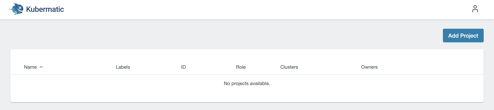
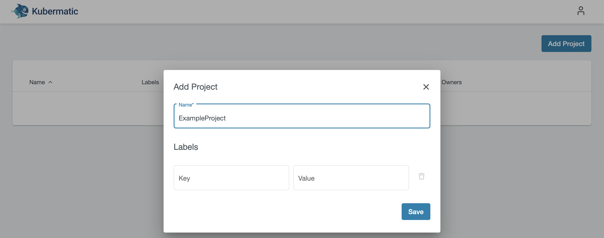
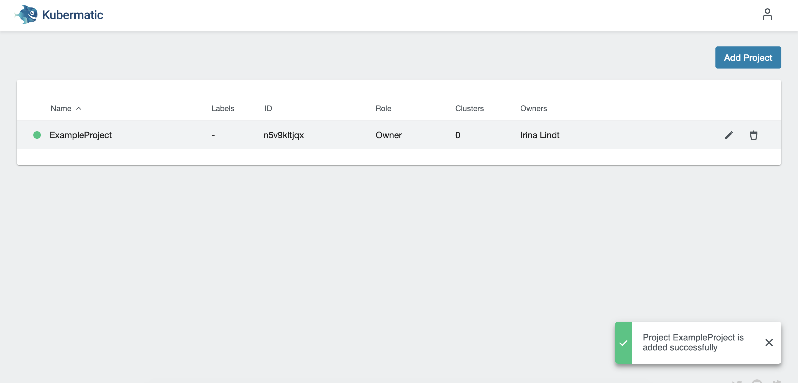
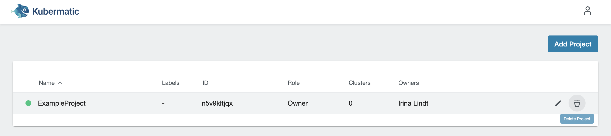

## Create a new project

Clusters are assigned to projects, so in order to create a cluster, you must create a project first. In the Kubermatic dashboard, choose `Add Project`:

Assign your new project a name:

After you click `Save`, the project will be created. If you click on it now, you will see options for adding clusters and SSH keys.

To delete a project, move the cursor over the line with the project name and click the trash bucket icon.

