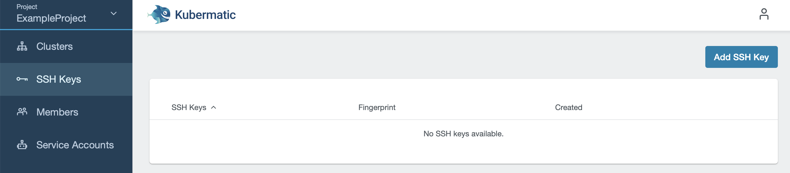

+++
title = "Add an SSH key to a project"
date = 2019-10-16T12:07:15+02:00
weight = 30
pre = "<b></b>"
+++
If you want to ssh into the created VMs, you need to provide your SSH public key. SSH keys are tied to a project. During cluster creation you can choose which SSH keys should be added to nodes. To add an SSH key, navigate to `SSH Keys` in the Dashboard and click on `Add SSH Key`:

This will create a pop up. Enter a unique name and paste the complete content of the SSH key into the respective field:

After you click on `Add SSH key`, your key will be created and you can now add it to clusters in the same project.
