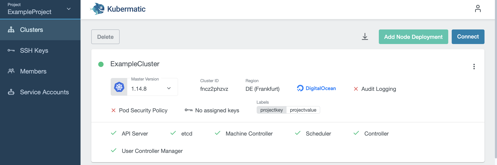
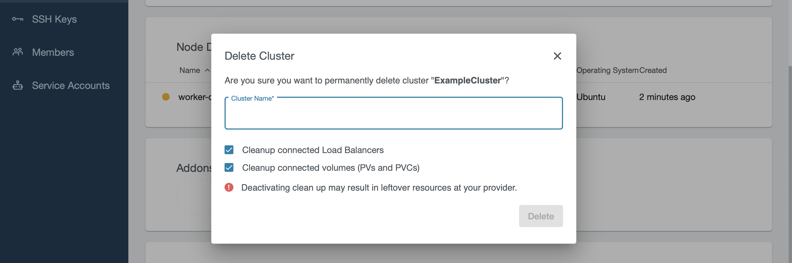

+++
title = "Delete a cluster"
date = 2019-11-07T12:07:15+02:00
weight = 50
pre = "<b></b>"
+++

To delete a cluster, navigate to `Clusters` and choose the cluster that you would like to delete. On the top left is a button `Delete`:

To confirm the deletion, type the name of the cluster into the text box:

The cluster will switch into deletion state afterwards, and will be removed from the list when the deletion succeeds.
