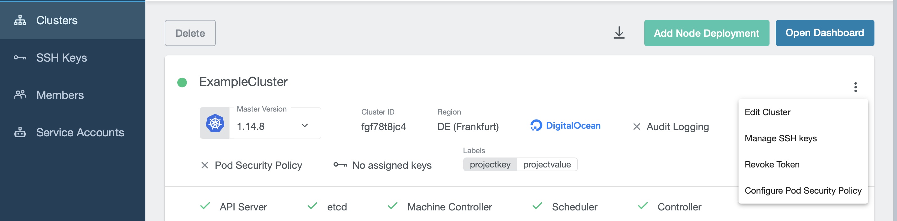
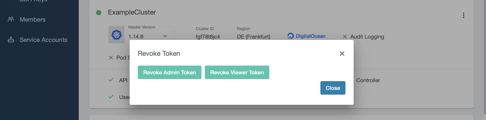

+++
title = "Download the kubeconfig"
date = 2019-11-13T12:07:15+02:00
weight = 60
+++

To download the kubeconfig, navigate to `Clusters` and select the correct cluster. On the top right you can find a download button:

You can revoke access for already downloaded kubeconfigs by revoking the token on the cluster detail page. To do so, click on the three-dot settings icon on the right to see the option `Revoke Token`:

As you can see, there are two options. Revoking the admin token means the kubeconfig becomes unusable for every user and must be downloaded again. Using `kubectl`with the invalid kubeconfig will result in an error message. Revoking the viewer token will only affect the project members who are in the `Viewer` group. You can see which group every project member belongs to on the `Members` page.

