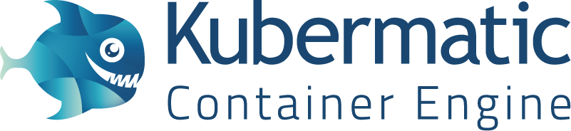

  

## What is Kubermatic?
Kubermatic is a  Cluster-as-a-Service that provides managed [ certified compliant](https://www.cncf.io/certification/software-conformance/) Kubernetes for your infrastructure.

With Kubermatic, you can deploy managed Kubernetes clusters at the click of button.
Kubermatic ensures that your cluster is highly-available and up-to-date at all times, ensuring that you can focus on developing your services.

Kubermatic directly hosts and manages the control plane of your Kubernetes cluster within a Kubermatic-hosted Kubernetes cluster.

Kubermatic is directly integrated with leading cloud providers such as DigitalOcean and Amazon Web Services. You can also deploy worker nodes in your own datacenter.

### Features
- #### Use Confomant Kubernetes
  By providing managed Kubernetes clusters for your infrastructure, Kubermatic makes getting started with Kubernetes as easy as it can be.
  Kubermatic empowers you to take advantage of all the advanced features that Kubernetes has to offer and increases the speed, flexibility and scalability of your cloud deployment workflow.

- #### Update Kubernetes
  Kubermatic provides live updates of your Kubernetes cluster without disrupting your daily business.
  Use all new features of Kubernetes as you increase scale without having to manually upgrade.

- #### Scale your cluster
  You can eaisly add and remove worker nodes in our dashboard.
  Simply specify the number of worker nodes you want your Kubernetes cluster, and Kubermatic scales the cluster up or down to your needs.

### How does Kubermatic work?

- [Introduction](intro.md)
- [Architecture](architecture.md)

### Roadmap
We are constantly developing Kubermatic to provide the best service to you. Some of the upcoming Kubermatic features are:

- #### Additional cloud providers
  We are constantly adding new cloud providers to offer you a wide range of platforms to chose from.  

- #### Automated Scaling
  Reacting on dynamic loads can be a difficult task.  With Kubermatic you will soon have the option of automated scaling of your Kubernetes cluster.
  By constantly monitoring, analyzing and predicting your workload, we scale your cluster on-demand to ensure you have the resources available for your users, and ensure that you are are only paying for what you need.

A more detailed roadmap can be found on [Trello](https://trello.com/b/8X7u8SXg/kubermatic-roadmap).

Note: _This description primarily refers to the cloud based service of Kubermatic, which is publicly available under https://cloud.kubermatic.io._
