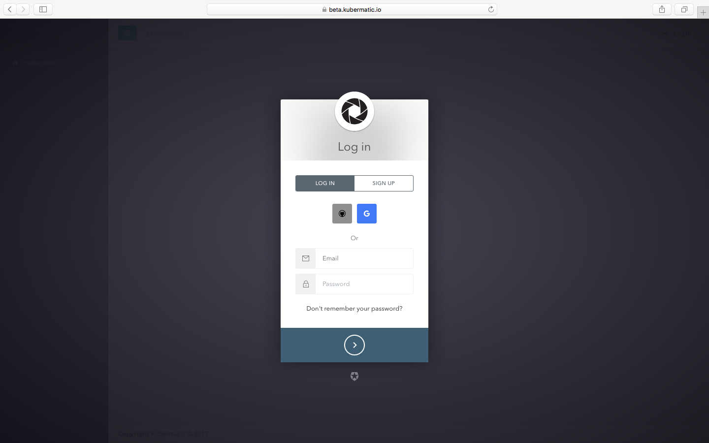
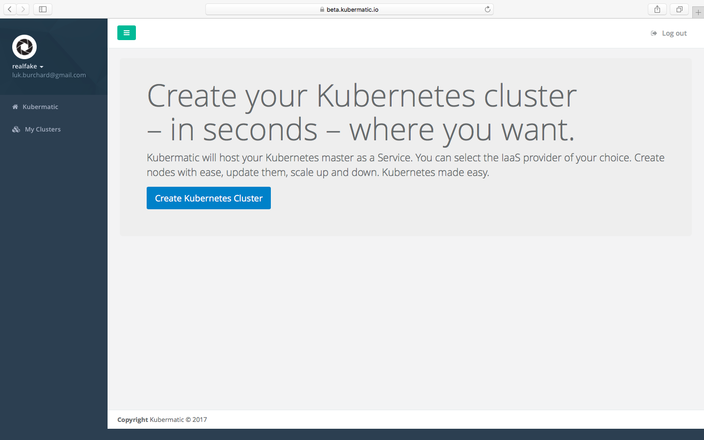
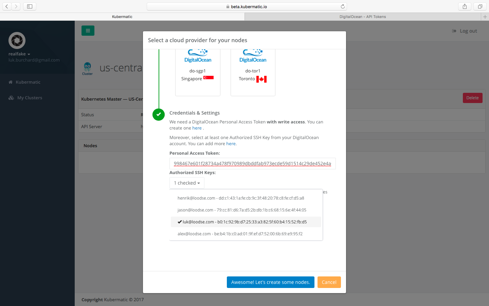

# Getting Started
Navigate to the dashboard on `https://beta.kubermatic.io`and login using your Github or Google profile.

Click on the `Create Kubernetes Cluster` button.

Type in a name for the cluster.
Select the locality of the seed cluster and click `Create Kubernetes Cluster`.
This will create the Kubernetes master components.

Your cluster is displayed as following:

You can see that the components are not running yet, because the status icons are still marked in blue.

After a few minutes, the status icons switch to green and your cluster is ready to go.

Click `Select a cloud provider`to determine where the actual nodes should run.
In this example, we choose a DigitalOcean datacenter in Amsterdam to demonstrate the independence of the seed cluster and the customer's nodes.

You now have to provide a DigitalOcean token with `Read` and `Write` access and select SSH keys saved in the DigitalOcean account to access them later over SSH.

Select the number and size of nodes to add to the cluster.

The dashboard will indicate `Node Ready` as soon as they are. This can take a few minutes.

Download the kubeconfig by clicking `download kubeconfig` to connect to your newly deployed Kubernetes server via kubectl.

Happy Hacking!
