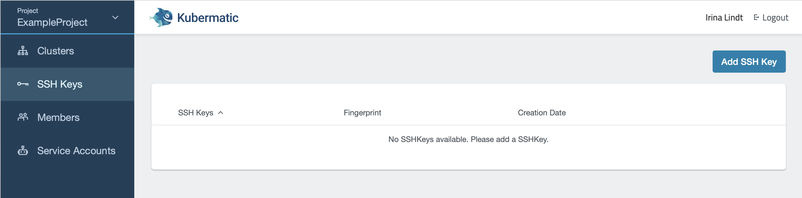
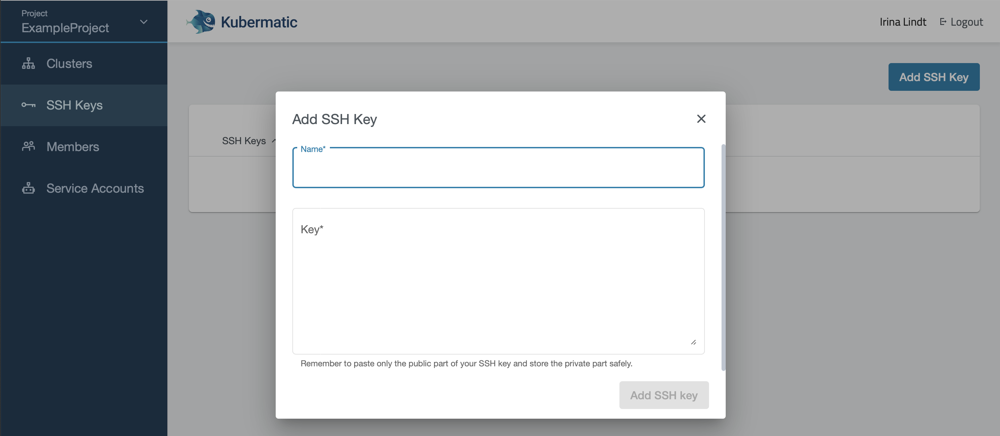

Kubermatic needs your SSH public key to create Kubernetes clusters, so that you also can ssh into the created VMs if needed. SSH keys are tied to a [project](../../02.Documentation/02.projects/default.en.md). During [cluster creation](../02.create-a-cluster/default.en.md) you can choose which SSH keys should be added to nodes. To add an SSH key, navigate to `Manage SSH Keys` in the Dashboard and click on `Add SSH Key`:

This will create a pop up. Enter a unique name and paste the complete content of the SSH key into the respective field:

After you click on `Add SSH key`, your key will be created and you can now add it to clusters in the same project.