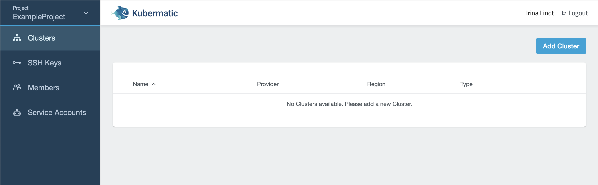
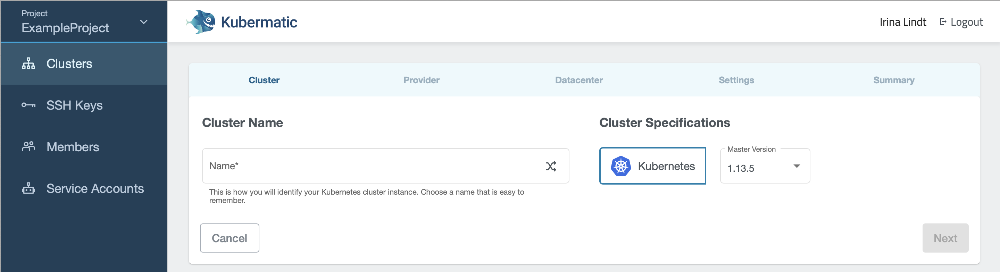
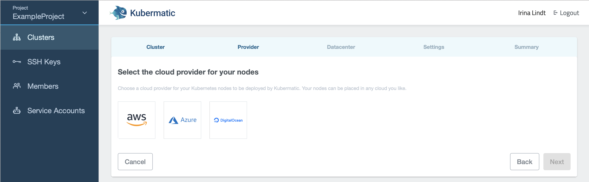
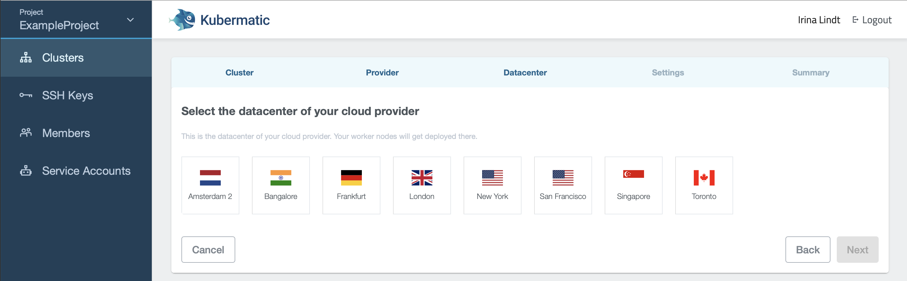
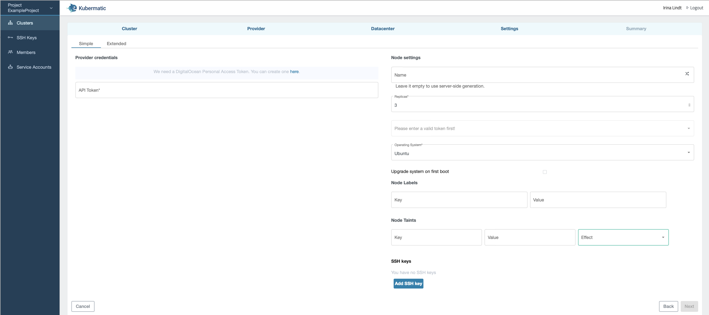
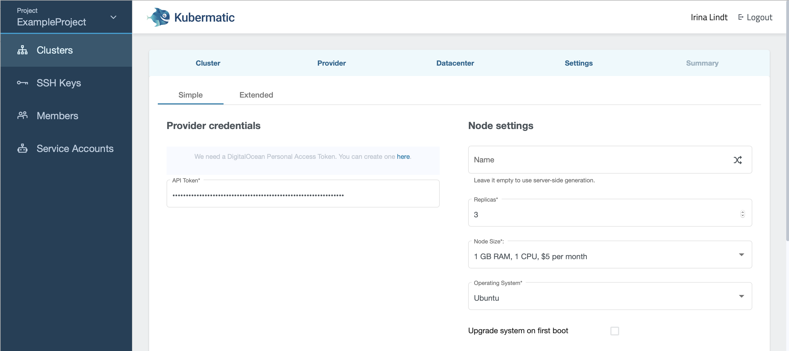
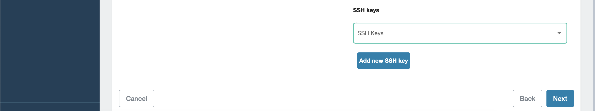
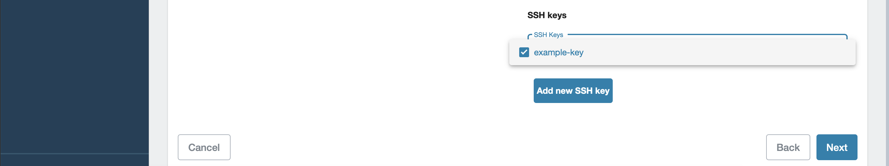
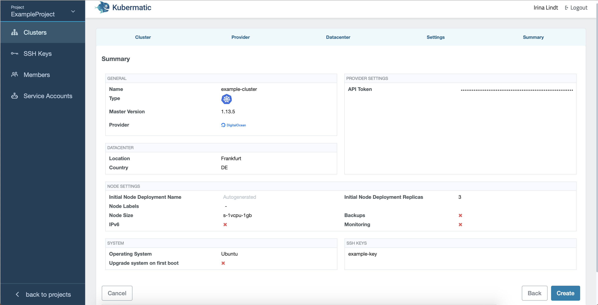

## Place to live

To create a new cluster, open the Kubermatic dashboard, choose a project, select the menu entry `Clusters` and click the button `Add Cluster` on the top right.


 Enter a name for your cluster and click Next:



Choose the [cloud provider](../../02.Documentation/05.supported-cloud-providers/default.en.md):



and the [region](../../02.Documentation/05.supported-cloud-providers/default.en.md) where the cluster shall live:



## Create the cluster

In the next step of the installer, enter the API token into the `Provider credentials` field. If you chose DigitalOcean, your view will look like this:



If you entered a valid API token, your node settings will be pre-filled:



Scroll down to choose or add an SSH key. You can choose one of the keys you already created for the project, or create a new one.






The chosen SSH key will be used for authentication for the default user (e.g. `ubuntu` for Ubuntu images) on all worker nodes. When you click on next, you will see a summary and the cluster creation will start after you confirm by clicking `Create`. You will then be forwarded to the cluster creation page where you can view the cluster creation process:



After all of the master components are ready, your cluster will create the configured number of worker nodes in your Kubermatic tenant. Fully created nodes will be marked with a green dot, pending ones with a yellow circle. You may [download the kubeconfig](../06.download-the-kubeconfig/default.en.md) now to be able to use `kubectl` with your cluster or just use the provided [Web Terminal](../../02.Documentation/10.metakube-webterminal/default.en.md). After all nodes are created you can use `kubectl` to view and check the status of the created nodes:

```bash
$ kubectl get nodes
NAME                          STATUS    ROLES     AGE       VERSION
kubermatic-w9tk8cmw62-22wgv   Ready     <none>    1m        v1.9.6
kubermatic-w9tk8cmw62-58pd6   Ready     <none>    1m        v1.9.6
kubermatic-w9tk8cmw62-hm5vl   Ready     <none>    1m        v1.9.6
```