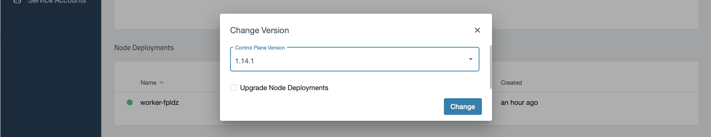

## Upgrade master components

When an upgrade for the master nodes is available, a little arrow pointing up will be shown besides the Master version:

To start the upgrade, just click on the link and choose the desired version (most recent, tested version is selected):

After the update is initiated, the master components will be upgraded in the background. Check the checkbox for `Upgrade Node Deployments` if you wish to upgrade the existing nodes as well.

