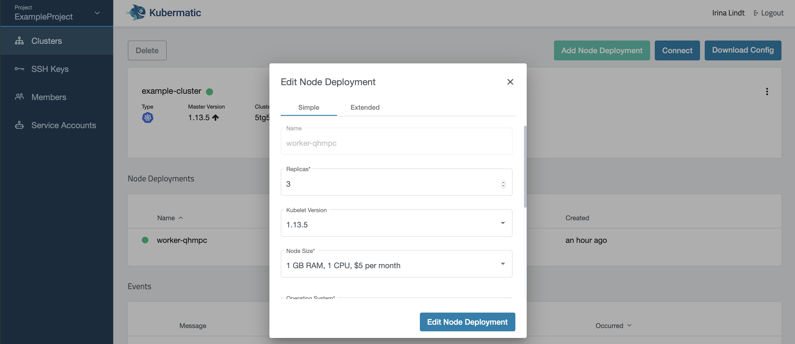

## Add new node deployment

To add a new node deployment navigate to your cluster view and click on the `Add Node Deployment` button:

In the popup you can then choose the number of nodes (replicas), kubelet version, etc for your newly created node deployment. All nodes created in this node deployment will have the chosen settings.

## Edit the node deployment

To add or delete a worker node you can easily edit the node deployment in your cluster. Navigate to the cluster overview and click on the node deployment you want to change. You will then see the node deployment overview. In this overview click on the edit icon:

In the popup you can now in- or decrease the number of, as well as the kubelet version, operating system, used image etc of the worker nodes which are managed by this node deployment:

